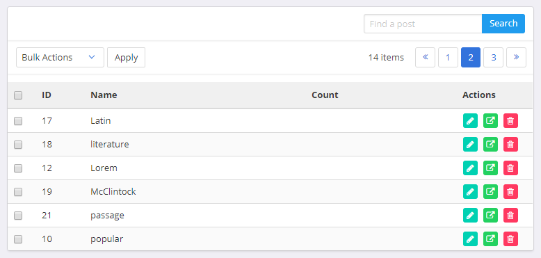

# Laravel Vue Pagination
Vue.js pagination component for Laravel pagination with Bulma.

## Requirements

* [Vue.js](https://vuejs.org/)
* [Laravel](http://laravel.com/docs/)
* [Bulma](https://bulma.io/documentation/overview/start/)

## Install

```bash
npm install laravel-vue-bulma-pagination
```

## Usage

Register the component:

```javascript

```

Use the component:

```html
<pagination v-bind:pagedata="tagsData" v-on:page-clicked="getTagsList"></pagination>
```

```javascript

```

### Props

| Name | Type | Description |
| --- | --- | --- |
| `pagedata` | Object | An object contains the value of a [Laravel pagination](https://laravel.com/docs/5.5/pagination#paginating-eloquent-results) response. |


### Events

| Name | Description |
| --- | --- |
| `page-clicked` | Triggered when a user changes page. Passes the new `page` number as a parameter. |


## Credits

I got inspired by seeing this repository [laravel-vue-pagination](https://github.com/gilbitron/laravel-vue-pagination). 

Released under the MIT license.

## Screenshot

